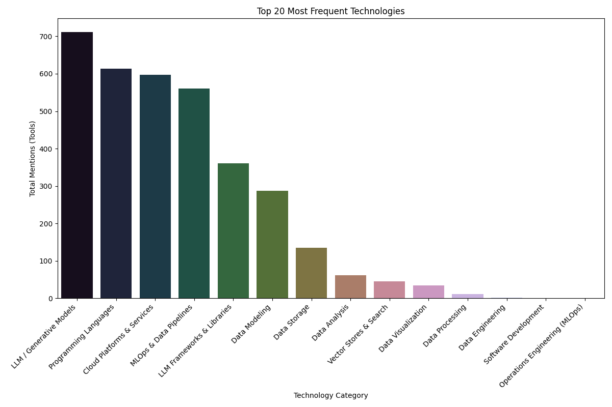

# Analysis of GenAI Engineer Job Roles: A Summary of Findings

## Introduction

This document presents a summary of findings from an analysis of GenAI Engineer job descriptions. The analysis was conducted by processing a large corpus of job ads and categorizing them based on a predefined schema of job tasks, technologies, and soft skills. This summary follows the spirit of the analysis conducted in the CAIN22 paper, "What Is an AI Engineer?".

## Overall Distributions

Before diving into the specific profiles, it's helpful to look at the overall distribution of required tasks, technologies, and skills across all analyzed job ads.

### Profile Distribution

### Job Task Distribution

### Technology Category Distribution

### Soft Skill Distribution

## Engineer Profiles

Our analysis reveals distinct profiles for different AI engineering roles. This section details the characteristics of the two primary profiles identified: the **GenAI Engineer** and the **ML Engineer**.

### The GenAI Engineer: A Profile

The GenAI Engineer is a role heavily focused on the practical application of large-scale generative models. Our analysis, based on a quantitative review of job descriptions, highlights a strong emphasis on the following areas:

**1. Core Job Tasks:**

- **Software Development:** This is the most prominent task for a GenAI Engineer, with a count of **1972** mentions. This indicates a strong need for traditional software engineering skills to build and deploy AI-powered applications.
- **Modeling:** With **1582** mentions, this is the second most important task. The focus here is on the application and fine-tuning of generative models, rather than building them from scratch.
- **Business Understanding:** At **751** mentions, there is a clear demand for engineers who can connect their technical work to business outcomes.

**2. Key Technologies:**

- **LLM / Generative Models:** This is the most frequently mentioned technology category, with a count of **743**. This confirms the central role of large language and other generative models in this profession.
- **Programming Languages:** A foundational skill, with **346** mentions. Python is the presumed leader in this category.
- **Cloud Platforms & Services:** With **310** mentions, it's clear that these roles are heavily reliant on cloud infrastructure for training and deployment.
- **LLM Frameworks & Libraries:** At **280** mentions, tools like LangChain and Hugging Face are essential for the GenAI Engineer's toolkit.

**3. Essential Soft Skills:**

- **Innovation & Ownership:** This was the most sought-after soft skill, with **869** mentions.
- **Communication & Collaboration:** A close second, with **734** mentions.
- **Problem Solving & Pragmatism:** With **598** mentions, there is a clear need for practical, results-oriented engineers.

In summary, the GenAI Engineer is a software-centric role, focused on leveraging existing generative models and cloud platforms to build innovative, business-oriented applications. They are expected to be proactive, collaborative, and pragmatic problem solvers.

### The ML Engineer: A Profile

The ML Engineer, in contrast to the GenAI Engineer, appears to be a role more deeply rooted in the entire data lifecycle. While there is overlap, the emphasis shifts from application development to the creation and maintenance of predictive models.

**1. Core Job Tasks:**

- **Software Development:** While still important (**504** mentions), it is significantly less emphasized than in the GenAI Engineer role.
- **Modeling:** This remains a key task (**447** mentions), but the context is more likely to be traditional machine learning (classification, regression, etc.) rather than generative models.
- **Data Engineering:** With **216** mentions, this is more prominent than for the GenAI Engineer, suggesting a closer involvement in the data preparation and pipeline building process.

**2. Key Technologies:**

- **Programming Languages:** Still a core skill, with **197** mentions.
- **Data Modeling:** This category is equally important for both roles (**117** mentions), but the underlying tools (e.g., Scikit-learn vs. LangChain) are likely to differ.
- **LLM / Generative Models:** While present (**125** mentions), it is far less of a focus compared to the GenAI Engineer role.
- **MLOps & Data Pipelines:** At **108** mentions, there is a clear focus on the operational aspects of the machine learning lifecycle.

**3. Essential Soft Skills:**

- **Communication & Collaboration:** The most important soft skill, with **383** mentions.
- **Innovation & Ownership:** Still highly valued, with **284** mentions.
- **Problem Solving & Pragmatism:** A key skill, with **239** mentions.

In summary, the ML Engineer is a data-centric role, focused on building and productionizing predictive models. They are more involved in the data engineering and MLOps aspects of the lifecycle and, while they use generative models, it is not their primary focus.
