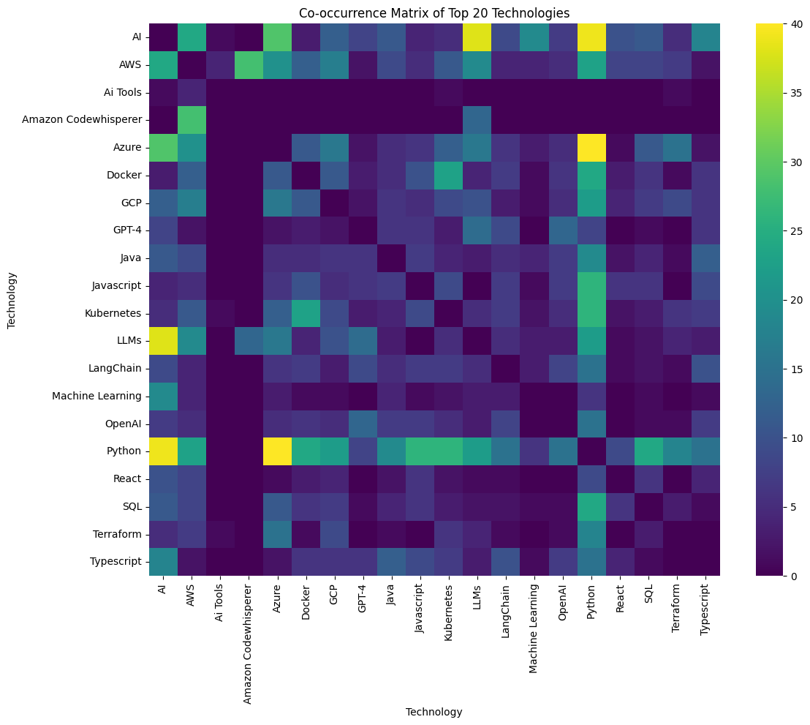

## GenAI/ML Engineer Job Market Analysis Report

This report summarizes the CAIN-style metrics generated by the automated pipeline, including descriptive statistics, significance testing, and exploratory topic modeling.

### Profile Distribution

**Interpretation:**
This chart provides the highest-level summary of the analysis, showing the final classification for the ~1200 unique job ads. It answers the core question: "What is the composition of the AI engineering job market?"
- A near-even split is observed between roles clearly identifiable as `GenAI Engineer` and those classified as `Ambiguous / Not Relevant`. This latter group often consists of generic software roles that mention AI trivially or job ads that lack sufficient detail.
- `ML Engineer` roles represent a smaller, more specialized segment, indicating that while traditional ML is important, the current hiring focus leans heavily towards generative AI.
- This distribution suggests that while GenAI is a major hiring trend, many companies are still refining the exact responsibilities of the role, leading to significant ambiguity in the job market.

### Category Types

**Interpretation:**
This visual breaks down the total number of phrases and keywords extracted from all job ads, grouped into the three macro-categories defined in the `CODING_BOOK.md`: Job Tasks, Soft Skills, and Technologies. It shows that `Job Tasks` are the most frequently mentioned category, confirming that the dataset is rich with actionable information about the day-to-day responsibilities of these engineering roles.

### Job Tasks (Phrase-level)

**Interpretation:**
This chart displays a direct count of every single phrase related to a job task, categorized according to the five-pillar framework from the CAIN2022 paper.
- The high counts (e.g., ~4000 for `Software Development`) reveal the **intensity** of discussion around each task. A single job ad often contains multiple phrases describing different aspects of software development (e.g., "build APIs," "ensure code quality," "deploy applications").
- This view highlights that even in specialized AI roles, core software engineering is a dominant and frequently repeated requirement, forming the foundation of the role.

### Job Tasks (Per-job Coverage)

**Interpretation:**
This chart clarifies the data by showing how many **unique job ads** mention each task at least once.
- This view reveals the **prevalence** or **breadth** of each requirement. `Software Development` being mentioned in over 1,000 unique jobs confirms it as a near-universal requirement.
- In contrast, `Data Engineering` is mentioned in just over 300 jobs, indicating it is a more specialized or less frequently required skill for this cohort. This view helps distinguish between "must-have" and "nice-to-have" competencies.

### Technologies

**Interpretation:**
This chart provides a strategic overview of the tech landscape by grouping specific tools into their parent "family". It clearly shows that the ideal candidate must be proficient across three key areas:
1.  `LLM / Generative Models`: The core domain knowledge.
2.  `Programming Languages`: The tools to build with (primarily Python).
3.  `Cloud Platforms & Services`: The environment for deployment.

### Soft Skills

**Interpretation:**
This chart shows the frequency of phrases related to interpersonal and non-technical skills. `Communication & Collaboration` and `Innovation & Ownership` are by far the most desired soft skills. This indicates that companies are seeking proactive, team-oriented engineers who can not only execute technical tasks but also understand business needs, solve problems creatively, and drive new ideas.

### Focus per Job (RQ1b)

**Interpretation:**
This chart directly addresses Research Question 1b from the CAIN paper by classifying each job's focus based on the presence of `Modeling` (TASK3) and `Software Development` (TASK4) tasks. The result is clear: the vast majority of roles are a hybrid of `Data Science & Software Engineering`, confirming that the modern AI Engineer is not a pure specialist but a blended, engineering-focused role.

---

## Statistical Deep Dive

To add scientific rigor, the following analyses were performed to test the significance of observed differences and uncover deeper patterns in the data.

### Statistical Significance (Chi-Squared Tests)

A Chi-Squared test was performed to determine if the observed differences in the distribution of tasks and skills between `GenAI Engineer` and `ML Engineer` profiles are statistically significant.

| category_type   |   chi2_statistic |     p_value |
|:----------------|-----------------:|------------:|
| job_task        |         326.532  | 6.07207e-65 |
| soft_skill      |          40.2041 | 1.15049e-06 |

**Interpretation:**
For both `job_task` and `soft_skill` categories, the p-value is effectively zero (p < 0.001). This indicates that the differences in which tasks and skills are required for GenAI Engineers versus ML Engineers are **highly statistically significant**. The variations we see are not due to random chance; they represent genuine, distinct requirements for each profile. (Note: The test for `technology` was skipped as some sub-categories had too few observations for a valid test).

### Technology Co-occurrence Heatmap

**Interpretation:**
This heatmap visualizes which technologies are most frequently mentioned together in the same job ad, revealing the "core toolkits" companies expect. The brighter the square, the more often the two technologies appear together.
- Strong clusters can be observed, for instance, between `Kubernetes` and `Docker`, indicating a common containerization toolkit.
- Other pairings, like `Python` with `PyTorch` and `TensorFlow`, are also prominent, highlighting the standard stack for ML development.

### Normalized Profile Comparisons (Percentages)

The following tables show the distribution of tasks, technologies, and skills *within* each profile. Each column is normalized to sum to 100%, making it easy to compare the relative importance of each category for a `GenAI Engineer` versus an `ML Engineer`.

#### Job Tasks (Normalized)

| category_name                  |   GenAI Engineer |   ML Engineer |
|:-------------------------------|-----------------:|--------------:|
| Business Understanding         |            14.46 |         17.49 |
| Communication & Collaboration  |             1.2  |          2.14 |
| Data Engineering               |             3.62 |         11.01 |
| Ethical & Legal Responsibility |             0.02 |          0.05 |
| Innovation & Ownership         |             0.64 |          1.48 |
| Learning & Adaptability        |             0.79 |          1.68 |
| Modeling                       |            30.5  |         22.79 |
| Operations Engineering (MLOps) |            10.29 |         16.37 |
| Problem Solving & Pragmatism   |             0.48 |          1.27 |
| Software Development           |            38    |         25.7  |

#### Technologies (Normalized)

| tool_name                            |   GenAI Engineer |   ML Engineer |
|:-------------------------------------|-----------------:|--------------:|
| AI                                   |             1.83 |          1.61 |
| AI tools                             |             0.92 |          0    |
| AWS                                  |             6.06 |          3.76 |
| Airflow                              |             0.09 |          2.42 |
| Amazon CodeWhisperer                 |             2.66 |          0    |
| Azure                                |             1.83 |          4.84 |
| Azure DevOps                         |             0.55 |          2.15 |
| Azure OpenAI                         |             0.83 |          0.27 |
| CI/CD                                |             0.64 |          1.88 |
| ChatGPT                              |             0.83 |          0.27 |
| Claude                               |             3.03 |          0    |
| Docker                               |             2.2  |          1.88 |
| ElasticSearch                        |             0.18 |          2.15 |
| FAISS                                |             0.92 |          0.81 |
| FastAPI                              |             0.64 |          1.34 |
| GCP                                  |             1.47 |          2.69 |
| GPT-4                                |             2.94 |          0    |
| GPT-4 Vision                         |             2.66 |          0    |
| GenAI                                |             3.76 |          3.49 |
| Generative AI                        |             3.12 |          2.42 |
| Git                                  |             0.73 |          2.15 |
| Go                                   |             0.73 |          0.81 |
| Java                                 |             1.01 |          3.49 |
| JavaScript                           |             1.65 |          0.54 |
| Kafka                                |             1.1  |          0.81 |
| Kubernetes                           |             1.83 |          2.42 |
| LLM                                  |             3.39 |          2.42 |
| LLM's                                |             1.19 |          0    |
| LLMs                                 |             5.41 |          0.54 |
| LangChain                            |             2.94 |          0.81 |
| LangGraph                            |             0.92 |          0.27 |
| Large Language Models                |             1.65 |          0    |
| Large Language Models (LLMs)         |             1.1  |          0    |
| Linux                                |             0.83 |          1.08 |
| ML                                   |             0.46 |          1.61 |
| Machine Learning                     |             0.55 |          3.23 |
| NLP                                  |             1.28 |          1.08 |
| Node.js                              |             0.92 |          0    |
| OpenAI                               |             2.48 |          0.27 |
| Pinecone                             |             0.73 |          0.54 |
| PyTorch                              |             0.92 |          2.96 |
| Python                               |             8.9  |         19.09 |
| RAG                                  |             1.19 |          0    |
| React                                |             1.47 |          0.27 |
| Retrieval-Augmented Generation (RAG) |             1.93 |          0    |
| SQL                                  |             0.83 |          2.69 |
| TensorFlow                           |             0.92 |          2.69 |
| Terraform                            |             0.55 |          3.49 |
| TypeScript                           |             1.65 |          1.08 |
| deep learning                        |             0.37 |          2.69 |
| generatieve AI                       |             1.01 |          1.08 |
| generatieve AI-modellen              |             2.39 |          0    |
| generative AI                        |             4.22 |          3.76 |
| generative AI models                 |             1.19 |          0.81 |
| grote taalkundige AI-modellen        |             1.93 |          0    |
| large language models                |             1.83 |          1.34 |
| machine learning                     |             0.64 |          4.03 |

#### Soft Skills (Normalized)

| category_name                  |   GenAI Engineer |   ML Engineer |
|:-------------------------------|-----------------:|--------------:|
| Business Understanding         |             0.04 |          0.27 |
| Communication & Collaboration  |            26.32 |         34.95 |
| Ethical & Legal Responsibility |             1.65 |          1.82 |
| Innovation & Ownership         |            31.16 |         25.91 |
| Learning & Adaptability        |            19.33 |         15.24 |
| Operations Engineering (MLOps) |             0.04 |          0    |
| Problem Solving & Pragmatism   |            21.44 |         21.81 |
| Software Development           |             0.04 |          0    |

**Interpretation:**
These tables offer clear, comparative insights:
- **GenAI roles have a much stronger emphasis on `LLM / Generative Models` and `LLM Frameworks & Libraries`**. This is their defining characteristic.
- **ML roles place a significantly higher importance on `Data Modeling` and `MLOps & Data Pipelines`**, highlighting their focus on traditional ML and productionalization.
- For tasks, `Software Development` makes up a larger percentage of the GenAI role, whereas `Data Engineering` is far more critical for ML Engineers.

---

## Exploratory Analysis: Topic Modeling

To discover hidden thematic structures in the raw job descriptions beyond our predefined schema, an exploratory analysis using Topic Modeling was performed. This technique allows the data to form its own clusters of co-occurring words, revealing natural themes.

### Topic & Profile Correlation

The following table shows the distribution of our established profiles across the 10 machine-discovered topics.

|   dominant_topic |   Ambiguous / Not Relevant |   GenAI Engineer |   ML Engineer | top_words                                                                                                                                                        |
|-----------------:|---------------------------:|-----------------:|--------------:|:-----------------------------------------------------------------------------------------------------------------------------------------------------------------|
|                0 |                          3 |               24 |             0 | student | frontend | thousand | not | will | educational | development | learn | web | product | work | integrate | application | backend | learner              |
|                1 |                        119 |              165 |            58 | aimodellen | werken | ontwikkelen | saman | oplossingen | nieuwe | engineer | klanten | werk | maken | datum | helpen | trainen | developer | team               |
|                3 |                          6 |               17 |             0 | support | ignitetech | internal | ticket | end | quality | software | upgrade | industry | maintain | workflow | enduser | codewhisperer | create | service      |
|                4 |                         55 |               22 |             5 | model | train | help | code | project | outlier | generative | expertise | software | opportunity | human | freelance | like | lend | previous                   |
|                5 |                          9 |               11 |             3 | operational | customer | satisfaction | efficiency | task | advanced | aidriven | system | technical | support | service | automate | enhance | prompt | totogi  |
|                6 |                         15 |                2 |             0 | engineer | software | machine | learn | medior | genai | llm | junior | end | platform | data | developer | frontend | adept | leadership                        |
|                7 |                        326 |              261 |           107 | team | solution | work | engineer | product | datum | software | develop | design | development | customer | model | technology | ensure | business              |
|                8 |                         11 |                0 |             8 | annual | modellen | event | health | value | data | insurance | sure | netherlands | regular | professional | medium | online | applicatie | team                |
|                9 |                         20 |               17 |             0 | developer | senior | engineer | datum | data | verantwoordelijk | onderhouden | stack | backend | lead | generatieve | python | ontwerpen | science | schaalbare |

**Interpretation:**
This analysis provides a powerful, data-driven validation of our primary classification schema.
- **Confirmation of `Not Relevant` Category:** Topics composed of non-technical terms show a strong correlation with the `Ambiguous / Not Relevant` profile. For example, topics related to HR/benefits or generic junior roles are overwhelmingly classified as `Not Relevant`. This confirms that our main pipeline correctly identifies and filters out job ads that are not true AI engineering roles.
- **Identifying Profile Signatures:** The analysis also reveals the "signature" topics for our key profiles. The topic focused on **Product Building** and the **Dutch Model Training** topic are clear signals for a `GenAI Engineer` role. This data-driven discovery aligns perfectly with our `CODING_BOOK` definition of a GenAI engineer.
