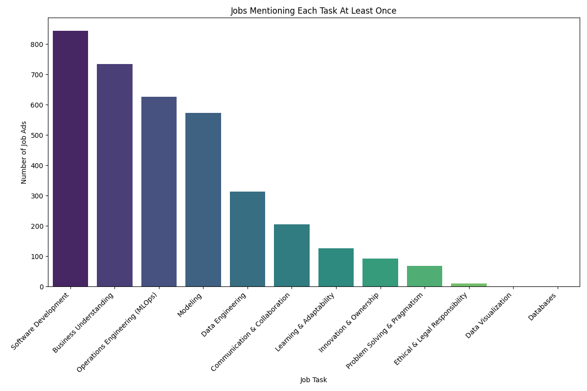

## GenAI/ML Engineer Job Market Analysis Report

This report summarizes the CAIN-style metrics generated by the automated pipeline.

### Profile Distribution

### Category Types

### Job Tasks (Phrase-level)

### Job Tasks (Per-job Coverage)

### Technologies

### Soft Skills

### Focus per Job (RQ1b)

### Top Tools Overall (per Technology Family)

| family                     | tool_name                 |   count |
|:---------------------------|:--------------------------|--------:|
| Cloud Platforms & Services | AWS                       |     107 |
| Cloud Platforms & Services | Azure                     |      82 |
| Cloud Platforms & Services | GCP                       |      37 |
| Cloud Platforms & Services | OpenAI                    |      19 |
| Cloud Platforms & Services | Azure DevOps              |      16 |
| Cloud Platforms & Services | Amazon CodeWhisperer      |      12 |
| Cloud Platforms & Services | Azure OpenAI              |      10 |
| Cloud Platforms & Services | Databricks                |      10 |
| Cloud Platforms & Services | Cloud                     |       9 |
| Cloud Platforms & Services | Microsoft                 |       9 |
| Cloud Platforms & Services | Azure Cloud               |       7 |
| Cloud Platforms & Services | Google Cloud Platform     |       7 |
| Cloud Platforms & Services | Amazon Web Services (AWS) |       6 |
| Cloud Platforms & Services | MS Azure OpenAI           |       6 |
| Cloud Platforms & Services | cloud                     |       6 |
| Cloud Platforms & Services | cloud technologies        |       6 |
| Cloud Platforms & Services | cloud-native technologies |       6 |
| Cloud Platforms & Services | GitHub                    |       5 |
| Cloud Platforms & Services | GitLab                    |       5 |
| Cloud Platforms & Services | Nvidia-stack              |       5 |
| Data Analysis              | SQL                       |      10 |
| Data Analysis              | Tableau                   |       6 |
| Data Analysis              | PySpark                   |       5 |
| Data Analysis              | BigQuery                  |       2 |
| Data Analysis              | DBT                       |       2 |
| Data Analysis              | Dataiku                   |       2 |
| Data Analysis              | ElasticSearch             |       2 |
| Data Analysis              | Looker                    |       2 |
| Data Analysis              | Pandas                    |       2 |
| Data Analysis              | data science              |       2 |

### Top Tools by Profile (per Technology Family)

| profile                  | family                     | tool_name                             |   count |
|:-------------------------|:---------------------------|:--------------------------------------|--------:|
| Ambiguous / Not Relevant | Cloud Platforms & Services | Azure                                 |      36 |
| Ambiguous / Not Relevant | Cloud Platforms & Services | AWS                                   |      25 |
| Ambiguous / Not Relevant | Cloud Platforms & Services | Azure DevOps                          |       9 |
| Ambiguous / Not Relevant | Cloud Platforms & Services | GCP                                   |       7 |
| Ambiguous / Not Relevant | Cloud Platforms & Services | GitHub                                |       5 |
| Ambiguous / Not Relevant | Cloud Platforms & Services | GitLab                                |       5 |
| Ambiguous / Not Relevant | Cloud Platforms & Services | Cloud                                 |       4 |
| Ambiguous / Not Relevant | Cloud Platforms & Services | Databricks                            |       4 |
| Ambiguous / Not Relevant | Cloud Platforms & Services | Databricks Data Intelligence Platform |       3 |
| Ambiguous / Not Relevant | Cloud Platforms & Services | Microsoft                             |       3 |
| Ambiguous / Not Relevant | Cloud Platforms & Services | Microsoft technologies                |       3 |
| Ambiguous / Not Relevant | Cloud Platforms & Services | Microsoft's Azure platform            |       3 |
| Ambiguous / Not Relevant | Cloud Platforms & Services | Azure Cloud                           |       2 |
| Ambiguous / Not Relevant | Cloud Platforms & Services | Azure Databricks                      |       2 |
| Ambiguous / Not Relevant | Cloud Platforms & Services | Cloud platforms                       |       2 |
| Ambiguous / Not Relevant | Cloud Platforms & Services | Cloud platforms and deployment tools  |       2 |
| Ambiguous / Not Relevant | Cloud Platforms & Services | Grafana                               |       2 |
| Ambiguous / Not Relevant | Cloud Platforms & Services | Microsoft 365                         |       2 |
| Ambiguous / Not Relevant | Cloud Platforms & Services | Nvidia                                |       2 |
| Ambiguous / Not Relevant | Cloud Platforms & Services | Prometheus                            |       2 |
| Ambiguous / Not Relevant | Data Analysis              | SQL                                   |       5 |
| Ambiguous / Not Relevant | Data Analysis              | Tableau                               |       4 |
| Ambiguous / Not Relevant | Data Analysis              | BI                                    |       1 |
| Ambiguous / Not Relevant | Data Analysis              | BigQuery                              |       1 |
| Ambiguous / Not Relevant | Data Analysis              | Data Analytics                        |       1 |
| Ambiguous / Not Relevant | Data Analysis              | Data Science tooling                  |       1 |
| Ambiguous / Not Relevant | Data Analysis              | Databricks Platform                   |       1 |
| Ambiguous / Not Relevant | Data Analysis              | Dataform                              |       1 |
| Ambiguous / Not Relevant | Data Analysis              | ElasticSearch                         |       1 |
| Ambiguous / Not Relevant | Data Analysis              | Lakehouse                             |       1 |
| Ambiguous / Not Relevant | Data Analysis              | N8N                                   |       1 |
| Ambiguous / Not Relevant | Data Analysis              | PySpark                               |       1 |
| Ambiguous / Not Relevant | Data Analysis              | data science                          |       1 |
| Ambiguous / Not Relevant | Data Modeling              | GraphQL                               |       2 |
| Ambiguous / Not Relevant | Data Modeling              | ML                                    |       2 |
| Ambiguous / Not Relevant | Data Modeling              | machine learning models               |       2 |
| Ambiguous / Not Relevant | Data Modeling              | AI                                    |       1 |
| Ambiguous / Not Relevant | Data Modeling              | AI Vision                             |       1 |
| Ambiguous / Not Relevant | Data Modeling              | AI/ML                                 |       1 |
| Ambiguous / Not Relevant | Data Modeling              | Application Insights                  |       1 |
